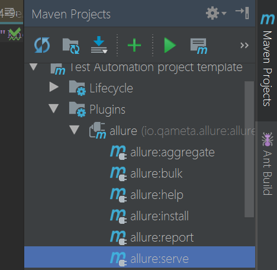

# Introduction
## Simple JDI examples
### 1. Create simple Login test
For the beginning I would like to show you how tipycal problems can be solved with JDI. Let's start from Login, most of the tests starts from this you need to login on site.

Java code example can be found by link [https://github.com/jdi-examples/jdi-introduction](https://github.com/jdi-examples/jdi-introduction)

**Test Scenario**

```java 
@Test
public void loginTest() {
    homePage.open();
    userIcon.click();
    loginForm.loginAs(DEFAULT_USER);
    homePage.checkOpened();
}
```
1. Open HomePage ([https://epam.github.io/JDI/index.html](https://epam.github.io/JDI/index.html))
2. Click on User Icon (to open login dialog)
2. Login as some default user
    - Enter 'epam' in login textfield
    - Enter '1234' in password textfield
    - Press 'Enter' button
3. Validate that HomePage is openned

```
[22:17.102  STEP] : Open 'Home Page'(url=https://epam.github.io/JDI/index.html)
[22:23.617  STEP] : Click on 'User Icon'
[22:23.727  STEP] : Login as User(userName:epam; password:1234)
[22:24.516  STEP] : Check that 'Home Page' is opened (url CONTAINS '/index.html'; title EQUALS 'Home Page')
```
**So simple!**
But this is not all, just Run this test in your IDE and what you will get?

1. Detailed log in Console output:

**Nice!** Isn't it? :ok_hand:

2. Same log in log file (src/test/.logs/) if you would like to see test execution results remotely (require log4j2.xml in src/test/resources)
3. Nice Allure report of your test execution! (require Allure settings in pom.xml)


Just move allure-results folder in target folder and run maven > Plugins > allure > allure:serve


```java 
@JSite("https://epam.github.io/JDI/")
public class JdiTestSite {
    public static HomePage homePage;
}
@BeforeSuite(alwaysRun = true)
public static void setUp() {
    initElements(JdiTestSite.class);
}

@Url("/index.html") @Title("Home Page")
public class HomePage extends WebPage {
    @Css("form") public static LoginForm loginForm;
    @Css("img#user-icon") public static Icon userIcon;
}

public class LoginForm extends Form<User> {
    @Css("#name") TextField userName;
    @Css("#password")  TextField password;
    @Css("[type=submit]") Button enter;
}
```
### 2. UI PageObjects
So now let's look on PageObjects we have in JDI. In example above for "Login test" we have following PageObjects:
* Site - entity for your application. Collects all the Pages of your application, that can be init in one command

* HomePage - Pages collects elements: common, complex and composite. Pages already have meta information about Url and Title and you can execute common actions with this Pages like: open, checkOpenned, get Url/Titile, zoom, scroll, work with cookies etc.
* LoginForm - Forms and Sections are logical parts of pages, they can include other sections or just elements. Forms also have additional actions like fill, submit, check etc.
* UI elements (Typified elements) like Button, TextField, Checkbox, Icon etc. - are simple elements that represents real elements on UI

This is common JDI project structure

```java 
@Test
public void nonPageObjectTest() {
    WebPage.openUrl("https://epam.github.io/JDI/index.html");
    $("img#user-icon").click();
    $("form #name").input("epam");
    $("form #password").input("1234");
    $("form [type=submit]").click();
    Assert.assertEquals(WebPage.getUrl(), "https://epam.github.io/JDI/index.html");
}
public class LoginForm extends Form<User> {
    TextField userName = $("#name");
    TextField password = $("#password");
    Button enter = $("[type=submit]");
}
```
### 3. Short term non Page Objects style
If you need to check somethhing fast and won't write Page Objects you can use simple like "JQuery/Selenide" style without any additional code

You also can init your Page Objects directly with elements if don't like annotations
<br/><br/><br/><br/><br/><br/><br/>
### 4. Smart Test locators
```
<input type="text" id="name">
<input type="text" id="last-name">
<input type="text" id="passport-code">
<input type="text" id="passport-number">
<button id="submit-button">
```
```java 
public class UserCard extends Form<User> {
    @Css("#name") TextField name;
    @Css("#last-name") TextField lastName;
    @Css("#passport-code") TextField passportCode;
    @Css("#passport-number") TextField passportNumber;   
    @Css("#submit-button") Button submitButton; 
}
If Smart locator rule is id
WebSettings.SMART_SEARCH_LOCATORS = asList("#%s");
and convertation rule is hyphen to java name
WebSettings.SMART_SEARCH_NAME = StringUtils::splitHyphen;
So you can write
public class UserCard extends Form<User> {
    TextField name;
    TextField lastName;
    TextField passportCode
    TextField passportNumber;  
    Button submitButton; 
}
or just write all TextFields in one line
public class UserCard extends Form<User> {
    TextField name, lastName, passportCode, passportNumber;  
    Button submitButton; 
}
```
If you have your developers follow some standard way to mark ui elements or you have an agreement to add special attribute you can even avoid to write locators for elements and make your page objects much more compact.

You can manage how to create locator from field name using 

**WebSettings.SMART_SEARCH** - Function that invoked if you have element has no locator or just setting a list of used locators using

**WebSettings.SMART_SEARCH_LOCATORS** - list of locators that can be used to try to find element

**WebSettings.SMART_SEARCH_NAME** - function how to create locator name from filed name (this value will be passed as %s parameter in SMART_SEARCH_LOCATORS)

<br/><br/><br/><br/><br/><br/><br/><br/><br/><br/><br/>
### 5. Asserts/Matchers integrated with elements
JDI has really flexible set of matchers integrated in elements

To access elements matchers you can use methods:<br/>
is()<br/>
assertThat()<br/>
has()<br/>
waitFor()<br/>
shouldBe()<br/>
All of them works in the same way and difference in they name just for tests readability <br/>
<br/>
All JDI matchers powered by most popular in Java world matcher library [Hamcrest](http://hamcrest.org/JavaHamcrest/)<br/>
And of course you can chain this matchers for multiple conditions validation

```java 
@Test
public void assertTest{
  title.is().text(containsString("jdi"));
  name.assertThat().text(is("Roman"));
  color.has().attr("color", is("red"))
}
@Test
public void chainAssertTest{
  title.assertThat()
    .text(containsString("jdi"))
    .attr("color", is("red"))
    .tag(is("h1"))
}
@Test
public void listAssertTest{
	searchResults.assertThat()
    .is().notEmpty()
    .size(equalTo(10))
		.any(e -> e.name.equals("Jdi intro 2"))
		.each(e -> e.name.toLowerCase().contains("jdi"))
		.onlyOne(e -> e.name.contains("Jdi intro 1"))
		.noOne(e -> e.name.contains("Selenide"));
}
@Test
public void tableChainTest() {
	users.assertThat()
		.displayed().size(6).size(greaterThan(3))
		.notEmpty().row(d -> d.user.contains("Ivan"))
		.allRows(d -> d.user.length() > 4)
		.atLeast(3).rows(d -> d.type.contains("User"))       
		.row(SPIDER_MAN)
		.exact(2).rows(d -> d.description.contains(":VIP"))
		.exact(1).rows(SPIDER_MAN);
}
```

## Start new project with JDI
## How to improve your Selenium project with new capabilities in few minutes
## Logging and Reporting
